[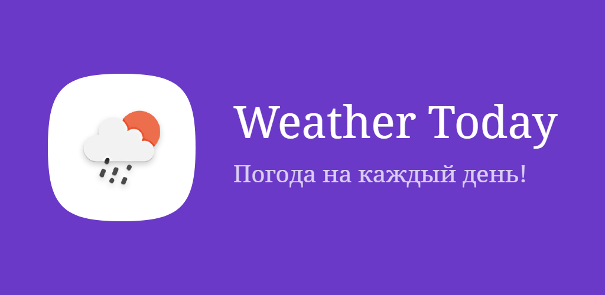][google_play_app_link]


[![telegram_badge]][telegram_link]
[![repo_star_badge]][github_link]
[![license_badge]][license_link]
[![code_size_badge]][github_link]


Weather for every day. Try it now on Google Play:

<a href='https://play.google.com/store/apps/details?id=com.Ruble.Pack.weather_today&pcampaignid=pcampaignidMKT-Other-global-all-co-prtnr-py-PartBadge-Mar2515-1'></a>


## Weather Today

✨ Handy application for tracking weather conditions with an amazing design.

Some interesting features:
- two weather providers are supported: open-meteo.com and openweathermap.org
- track hourly, current and 7-day weather
- save the necessary locations
- two languages are available: English and Russian
- set the units for speed, temperature, and pressure
- built-in support for the OpenWeather service api key
- highly customizable interface: font (and size), scrolling physics, 2 types of main interface and sooo many color themes


## Screenshots


### Screenshots from smartphone

| 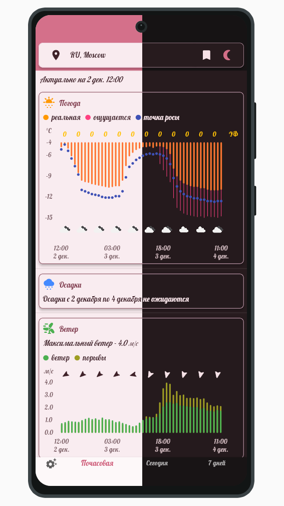 | 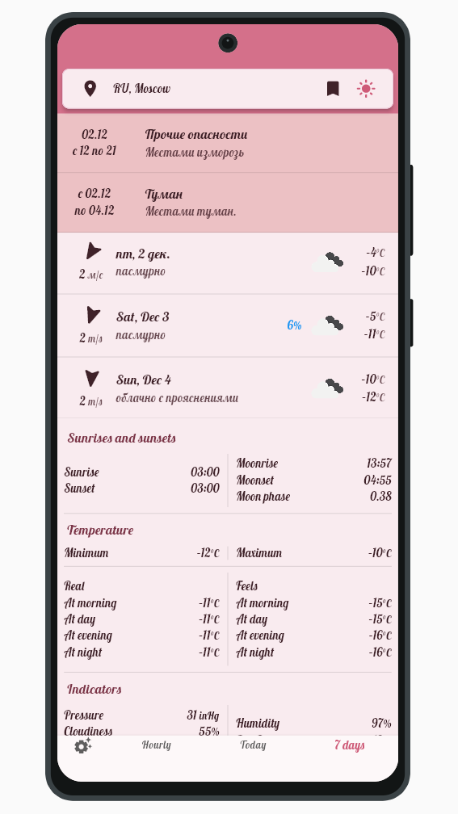 | 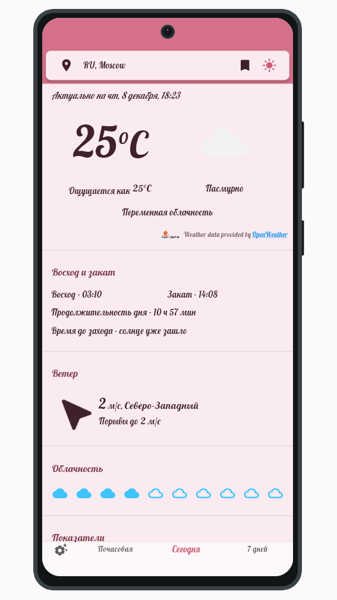 | 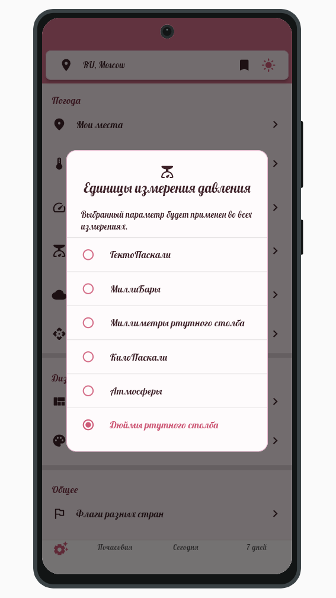 |
|---------------------------------------------------------------------|-----------------------------------------------------------------------------|-------------------------------------------------------------|-------------------------------------------------------------|
| 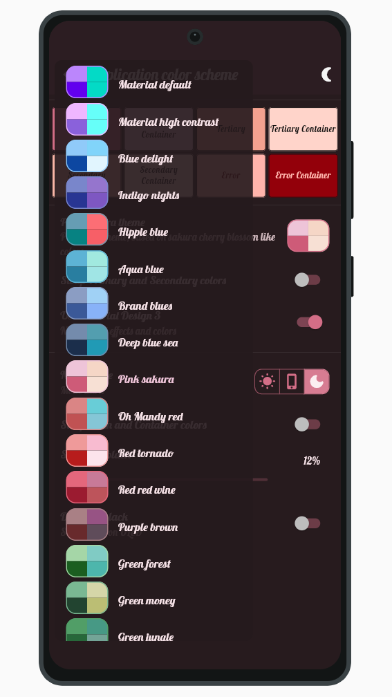         | 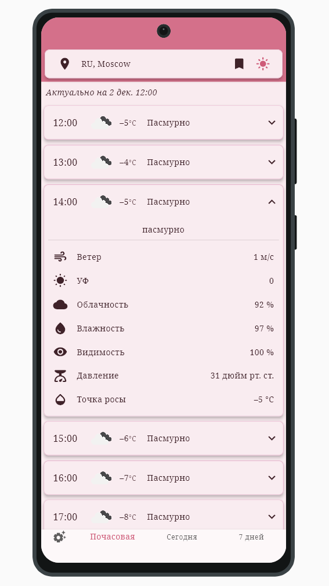                 | 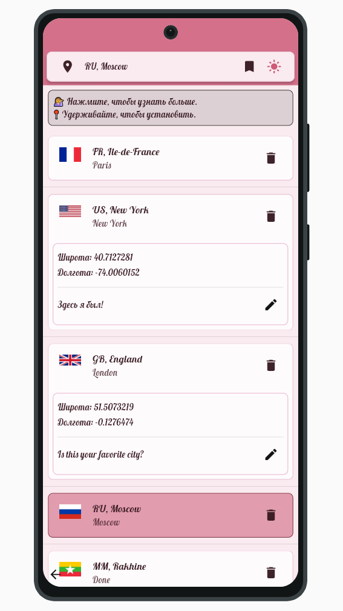 | 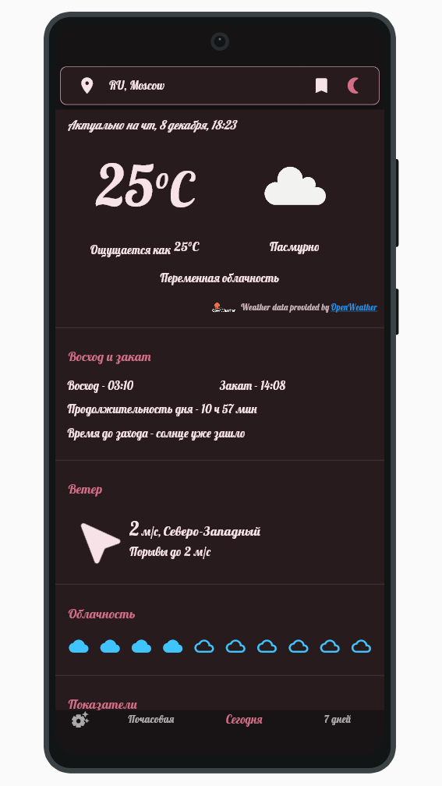 |


### Screenshots from a 10-inch tablet

| 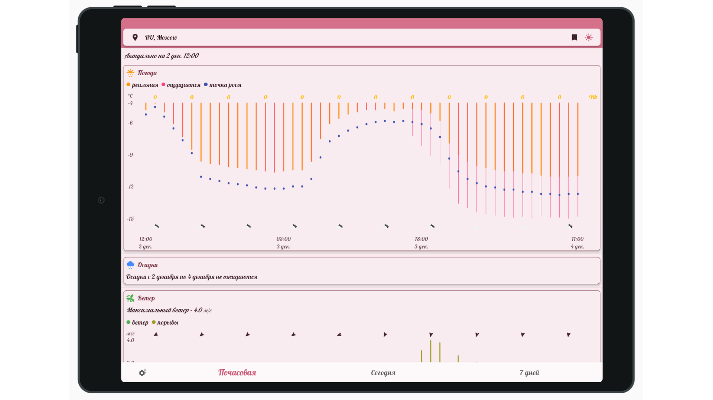 | 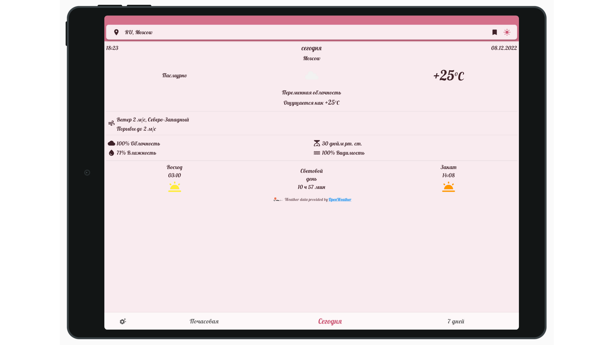 |
|------------------------------------|------------------------------------|


## Table of Contents

<!-- TOC -->
  * [Weather Today](#weather-today)
  * [Screenshots](#screenshots)
    * [Screenshots from smartphone](#screenshots-from-smartphone)
    * [Screenshots from a 10-inch tablet](#screenshots-from-a-10-inch-tablet)
  * [Table of Contents](#table-of-contents)
  * [Building an android application](#building-an-android-application)
    * [build apk files](#build-apk-files)
  * [Possible problems/errors](#possible-problemserrors)
    * [Errors in the generated files](#errors-in-the-generated-files)
    * [Change in the app's launcher icon](#change-in-the-apps-launcher-icon)
  * [Articles and materials for study](#articles-and-materials-for-study)
  * [How do you support the project and the author?](#how-do-you-support-the-project-and-the-author)
  * [License](#license)
<!-- TOC -->

## Building an android application


### build apk files

1. `flutter clean`
2. `flutter pub get`
3. Building apk use `flutter build apk`:

   with flag ( 🔴 required, 🟢 optional ):

   - 🔴 `--dart-define 'API_WEATHER=YourApiKey'` - your api key for the weather service [openweathermap.org](https://openweathermap.org/). Read more [here](https://github.com/PackRuble/weather_pack)
   - 🔴 `--pub` - run the `flutter pub get` command before building
   - 🟢 `--flavor` - build a custom app flavor as defined by platform-specific build setup. Supports the use of product flavors in Android Gradle scripts, and the use of custom Xcode schemes.
   - 🟢 `--target=<path>` - the main entry-point file of the application, as run on the device. If the "--target" option is omitted, but a file name is provided on the command line, then that is used instead (defaults to "lib\main.dart")
   - 🟢 `--target-platform=android-arm,android-arm64,android-x64` - choose the right platforms
   - 🟢 `--split-per-abi` - build a release APK for each target ABI (Application Binary Interface)
   - 🟢 `--obfuscate --split-debug-info=build/app/outputs/symbols` - once you’ve obfuscated your binary, save the symbols file. You need this if you later want to de-obfuscate a stack trace.


## Possible problems/errors


### Errors in the generated files

This project uses the [build_runner](https://pub.dev/packages/build_runner) for generating files. If you have a problem with the files `*.g.dart` and others generated files try this:

```shell
flutter pub run build_runner build
```

with flag(optional):
- 🟢 `--delete-conflicting-outputs` - deletes previously generated files
- 🟢 `--build-filter=lib/PATH_FILE` - build concrete file


### Change in the app's launcher icon

The  [icons_launcher](https://pub.dev/packages/icons_launcher) package is used for generate app's launcher icon. If there are problems, check the file [icons_launcher.yaml](icons_launcher.yaml), which contains additional explanations.

Or try use this command:

```shell
`dart run icons_launcher:create
```


## Articles and materials for study

- [Я сделал Cardoteka и вот как её использовать \[кто любит черпать\] / Хабр](https://habr.com/ru/articles/783712/)
- [Cardoteka — техническая начинка и аналитика решений типобезопасной SP \[кто любит вдаваться\] / Хабр](https://habr.com/ru/articles/801089/)
- [SharedPreferences отличное хранилище для вашего flutter-приложения. Но есть нюансы… / Хабр](https://habr.com/ru/articles/724706/)
- [Как быстро и легко локализовать приложение на flutter. Riverpod + slang](https://habr.com/ru/post/718310/)


## How do you support the project and the author?

You can:

🟢 give this repository a star

>[][github_link]

🟢 to donate money on a 🍕. To do this, either contact me via email or visit the Telegram group.

|  pack.ruble@gmail.com |  https://t.me/rublepack |
|------------------------------------------------------------------------------------|-----------------------------------------------------------------------------------------|


🟢 share the project on social networks

🟢 create an issue or pull request or fork

**Thank you for your help, kisses to all 💋**


## License

Weather Today source code is licensed under the Apache License, Version 2.0  License. Check [LICENSE](LICENSE) for more details.

```
Copyright 2022-2025 Ruble

Licensed under the Apache License, Version 2.0 (the "License");
you may not use this file except in compliance with the License.
You may obtain a copy of the License at

    http://www.apache.org/licenses/LICENSE-2.0

Unless required by applicable law or agreed to in writing, software
distributed under the License is distributed on an "AS IS" BASIS,
WITHOUT WARRANTIES OR CONDITIONS OF ANY KIND, either express or implied.
See the License for the specific language governing permissions and
limitations under the License.
```

---


> “Google Play and the Google Play logo are trademarks of Google LLC.”

[telegram_badge]: https://img.shields.io/badge/Telegram%20channel-❤️-FEBE8C?style=plastic&logo=telegram
[telegram_link]: https://t.me/+AkGV73kZi_Q1YTMy

[license_badge]: https://img.shields.io/github/license/PackRuble/weather_today?style=plastic&logo=apache
[license_link]: https://github.com/PackRuble/weather_today/blob/master/LICENSE

[code_size_badge]: https://img.shields.io/github/languages/code-size/PackRuble/weather_today?style=plastic
[repo_star_badge]: https://img.shields.io/github/stars/PackRuble/weather_today?style=plastic&logo=github

[github_link]: https://github.com/PackRuble/weather_today
[google_play_app_link]: https://play.google.com/store/apps/details?id=com.Ruble.Pack.weather_today
